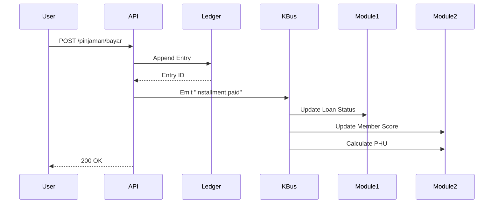

# 📖 Arsitektur Final Koperasi OS

## 🎯 Visi & Tujuan Sistem

**Visi:** Membangun platform digital koperasi yang transparent, auditable, dan user-friendly untuk memberdayakan ekonomi kelurahan Merah Putih Duri Kosambi.

**Tujuan Bisnis:**

- Digitalisasi 100% transaksi koperasi
- Meningkatkan kepercayaan anggota melalui transparansi
- Efisiensi operasional 70%
- Compliance SAK-EP & audit-ready
- Skalabilitas hingga 10,000+ anggota

**Tujuan Teknis:**

- Zero data inconsistency
- 99.9% uptime
- < 2 detik response time
- Audit trail lengkap & immutable
- Real-time reporting

## 🏗️ Prinsip Arsitektur (The 5 Commandments)

### 1. Ledger-First Architecture

Setiap transaksi finansial → Ledger Entry dulu → Baru update state

- Ledger adalah source of truth
- State bisa di-rebuild dari ledger
- Audit trail natural
- Compliance SAK-EP otomatis

### 2. Event-Driven Architecture

- Loose coupling antar modul
- Easy to add new features
- Async processing = faster response
- Natural audit log

### 3. Domain-Driven Design

- Bounded Contexts: Member, Lending, Accounting, Inventory, Billing
- Ubiquitous Language yang konsisten di seluruh sistem
- Aggregates untuk konsistensi transaksional

### 4. Security by Design

- Defense in Depth: API Gateway → Auth Check → RLS Policy → Business Logic → Audit Log
- Zero Trust Model dengan Row Level Security
- Audit Everything

### 5. Idempotency

- No Duplicates
- Retry Safe
- Deterministic

## 🛠️ Tech Stack

| Layer | Technology | Alasan |
|-------|------------|--------|
| **Frontend** | Next.js 16 (App Router) | RSC, SSR, SEO-friendly, TypeScript native |
| **Backend** | Supabase Edge Functions | Serverless, auto-scale, dekat dengan DB |
| **Database** | PostgreSQL (Supabase) | ACID, RLS native, JSON support, mature |
| **Auth** | Supabase Auth | Built-in, RLS integration, social login |
| **Storage** | Supabase Storage | CDN, RLS, image optimization |
| **Realtime** | Supabase Realtime | WebSocket, broadcast, presence |
| **Event Bus** | PostgreSQL (pg_notify) | Simple, reliable, transactional |
| **Cache** | Redis (Upstash) | Idempotency store, session, rate limit |
| **Search** | PostgreSQL FTS | Built-in, no extra infra |
| **Monitoring** | Sentry + Vercel Analytics | Error tracking, performance |

> Catatan Implementasi Pembayaran: Saat ini QRIS menggunakan provider mock melalui `PaymentService` dan route API untuk polling status. Migrasi ke Edge Functions akan dilakukan untuk provider nyata (Xendit/Midtrans) dan webhook yang aman.

## 🧭 Feature Alignment Smartscoop & Kopdesa

- Retail POS
  - Voucher dan Point, Discount, Donasi, Split Bill
  - PPN Masukan/Keluaran per item
  - Stok Opname, barang konsinyasi
  - Pembayaran Tunai/QRIS/Saldo Simpanan
- Simpan Pinjam
  - Produk simpanan (umum, rencana, berjangka), autodebet simpanan wajib
  - Pembayaran angsuran via QRIS
- Master Data
  - Karyawan, Pelanggan Toko, Aset Barang, Pengaturan Email
  - Profil Koperasi, Anggota, Pengurus
- Unit Usaha
  - Klinik/Apotek: pasien, layanan medis/farmasi, etiket, lab, pembayaran
  - Gudang: DO, penimbangan, lelang online
- Pelaporan & Konsolidasi
  - Konsolidasi per unit usaha, akuntansi SAK-EP, ledger-first

## 🗺️ Roadmap Bertahap

- Tahap 1: POS Enhancement (voucher/point, split bill, donasi, stok opname, PPN item-level)
- Tahap 2: Pajak & Pelaporan (PPN Masukan/Keluaran, konsolidasi laporan per unit)
- Tahap 3: Simpan Pinjam (autodebet wajib, UI pembayaran kredit via QRIS)
- Tahap 4: Klinik/Apotek (data pasien, farmasi, billing)
- Tahap 5: Gudang/Cold Storage (DO, penimbangan, lelang)
- Tahap 6: Notifikasi (email/WA) dan integrasi provider pembayaran nyata
## 📋 Analysis & Recommendations (Post-Review)

Based on comprehensive analysis of the roadmap and current progress, the following strategic adjustments have been adopted to ensure project success.

### 🎯 Key Strengths
1.  **Solid Architecture**: Ledger-first, Event-driven, and Security-by-design principles are correctly prioritized.
2.  **Impressive Progress**: Phase 1 (Auth, RBAC, RLS, CI/CD) is largely complete with high quality.
3.  **Right Tech Stack**: Next.js + Supabase + TypeScript provides the ideal balance of speed and type safety.

### ⚠️ Critical Areas & Risks
1.  **Business Logic Complexity**: SHU calculations and SAK-EP compliance are complex. **Mitigation**: Dedicated "Rule Engine" module.
2.  **Data Migration**: Moving from legacy systems is high-risk. **Mitigation**: Parallel run strategy and strict validation.
3.  **Operational Complexity**: Too many business units at once. **Mitigation**: Phased rollout (Simpan Pinjam first).

### 🔧 Technical Debt Strategy
1.  **Database Partitioning**: Implement monthly partitions for `ledger_entry` to handle scale.
2.  **Backup Strategy**: Implement Point-in-Time Recovery (PITR) and daily incremental backups.
3.  **Monitoring**: Track critical metrics (Double-entry balance, RLS violations, Transaction failure rate).

### 📊 Success Metrics
*   **Technical**: 100% Ledger Consistency, <1s API Response, 99.9% Uptime.
*   **Business**: Loan processing < 24h, User Satisfaction > 4/5.

---

## 🗄️ Database Schema

### Core Tables

#### 1. Koperasi (Master Tenant)

```sql
CREATE TABLE koperasi (
  id UUID PRIMARY KEY DEFAULT gen_random_uuid(),
  nama TEXT NOT NULL,
  nomor_badan_hukum TEXT UNIQUE NOT NULL,
  tanggal_berdiri DATE NOT NULL,
  alamat TEXT NOT NULL,
  kelurahan TEXT NOT NULL,
  kecamatan TEXT NOT NULL,
  kota TEXT NOT NULL,
  provinsi TEXT NOT NULL,
  kode_pos TEXT,
  phone TEXT,
  email TEXT,
  website TEXT,
  npwp TEXT UNIQUE,
  siup TEXT,
  config JSONB DEFAULT '{}'::jsonb,
  is_active BOOLEAN DEFAULT true,
  created_at TIMESTAMPTZ DEFAULT NOW(),
  created_by UUID,
  updated_at TIMESTAMPTZ DEFAULT NOW(),
  updated_by UUID,
  deleted_at TIMESTAMPTZ,
  version INTEGER DEFAULT 1
);
```

#### 2. Member (Anggota)

```sql
CREATE TABLE member (
  id UUID PRIMARY KEY DEFAULT gen_random_uuid(),
  koperasi_id UUID NOT NULL REFERENCES koperasi(id),
  nomor_anggota TEXT NOT NULL,
  nama_lengkap TEXT NOT NULL,
  nik TEXT UNIQUE NOT NULL,
  phone TEXT NOT NULL,
  email TEXT,
  alamat_lengkap TEXT NOT NULL,
  member_type member_type DEFAULT 'regular',
  status member_status DEFAULT 'pending',
  tanggal_daftar DATE NOT NULL DEFAULT CURRENT_DATE,
  tanggal_aktif DATE,
  user_id UUID UNIQUE REFERENCES auth.users(id),
  created_at TIMESTAMPTZ DEFAULT NOW(),
  created_by UUID,
  updated_at TIMESTAMPTZ DEFAULT NOW(),
  updated_by UUID,
  deleted_at TIMESTAMPTZ,
  version INTEGER DEFAULT 1
);
```

#### 3. User Roles (Authorization)

```sql
CREATE TABLE user_role (
  id UUID PRIMARY KEY DEFAULT gen_random_uuid(),
  koperasi_id UUID NOT NULL REFERENCES koperasi(id),
  user_id UUID NOT NULL REFERENCES auth.users(id),
  member_id UUID REFERENCES member(id),
  role user_role_type NOT NULL,
  permissions JSONB DEFAULT '[]'::jsonb,
  unit_usaha_id UUID REFERENCES unit_usaha(id),
  is_active BOOLEAN DEFAULT true,
  valid_from TIMESTAMPTZ DEFAULT NOW(),
  valid_until TIMESTAMPTZ,
  created_at TIMESTAMPTZ DEFAULT NOW(),
  created_by UUID,
  updated_at TIMESTAMPTZ DEFAULT NOW(),
  updated_by UUID,
  deleted_at TIMESTAMPTZ,
  version INTEGER DEFAULT 1
);
```

#### 4. Accounting Period

```sql
CREATE TABLE accounting_period (
  id UUID PRIMARY KEY DEFAULT gen_random_uuid(),
  koperasi_id UUID NOT NULL REFERENCES koperasi(id),
  period_name TEXT NOT NULL,
  period_type TEXT NOT NULL CHECK (period_type IN ('monthly', 'quarterly', 'yearly')),
  year INTEGER NOT NULL,
  month INTEGER CHECK (month BETWEEN 1 AND 12),
  quarter INTEGER CHECK (quarter BETWEEN 1 AND 4),
  start_date DATE NOT NULL,
  end_date DATE NOT NULL,
  status period_status DEFAULT 'draft',
  closed_at TIMESTAMPTZ,
  closed_by UUID REFERENCES auth.users(id),
  opening_balances JSONB,
  closing_balances JSONB,
  notes TEXT,
  created_at TIMESTAMPTZ DEFAULT NOW(),
  created_by UUID,
  updated_at TIMESTAMPTZ DEFAULT NOW(),
  updated_by UUID,
  deleted_at TIMESTAMPTZ,
  version INTEGER DEFAULT 1
);
```

#### 5. Unit Usaha

```sql
CREATE TABLE unit_usaha (
  id UUID PRIMARY KEY DEFAULT gen_random_uuid(),
  koperasi_id UUID NOT NULL REFERENCES koperasi(id),
  kode_unit TEXT NOT NULL,
  nama_unit TEXT NOT NULL,
  deskripsi TEXT,
  jenis_unit TEXT NOT NULL CHECK (jenis_unit IN (
    'simpan_pinjam', 'sembako', 'frozen_food', 'lpg', 
    'akuaponik', 'maggot', 'pupuk', 'klinik', 
    'apotek', 'billboard', 'other'
  )),
  pic_name TEXT,
  pic_phone TEXT,
  alamat TEXT,
  config JSONB DEFAULT '{}'::jsonb,
  is_active BOOLEAN DEFAULT true,
  tanggal_operasi DATE,
  created_at TIMESTAMPTZ DEFAULT NOW(),
  created_by UUID,
  updated_at TIMESTAMPTZ DEFAULT NOW(),
  updated_by UUID,
  deleted_at TIMESTAMPTZ,
  version INTEGER DEFAULT 1
);
```

### Ledger Tables

#### 1. Chart of Accounts

```sql
CREATE TABLE chart_of_accounts (
  id UUID PRIMARY KEY DEFAULT gen_random_uuid(),
  koperasi_id UUID NOT NULL REFERENCES koperasi(id),
  account_code TEXT NOT NULL,
  account_name TEXT NOT NULL,
  parent_code TEXT,
  level INTEGER NOT NULL CHECK (level BETWEEN 1 AND 5),
  account_type account_type NOT NULL,
  normal_balance TEXT NOT NULL CHECK (normal_balance IN ('debit', 'credit')),
  is_header BOOLEAN DEFAULT false,
  is_system BOOLEAN DEFAULT false,
  allow_transaction BOOLEAN DEFAULT true,
  unit_usaha_id UUID REFERENCES unit_usaha(id),
  description TEXT,
  is_active BOOLEAN DEFAULT true,
  created_at TIMESTAMPTZ DEFAULT NOW(),
  created_by UUID,
  updated_at TIMESTAMPTZ DEFAULT NOW(),
  updated_by UUID,
  deleted_at TIMESTAMPTZ,
  version INTEGER DEFAULT 1
);
```

#### 2. Ledger Entry (Double Entry)

```sql
CREATE TABLE ledger_entry (
  id UUID PRIMARY KEY DEFAULT gen_random_uuid(),
  koperasi_id UUID NOT NULL REFERENCES koperasi(id),
  period_id UUID NOT NULL REFERENCES accounting_period(id),
  tx_id UUID NOT NULL,
  tx_type TEXT NOT NULL,
  tx_reference TEXT,
  account_debit TEXT NOT NULL REFERENCES chart_of_accounts(account_code),
  account_credit TEXT NOT NULL REFERENCES chart_of_accounts(account_code),
  amount NUMERIC(15,2) NOT NULL CHECK (amount > 0),
  description TEXT NOT NULL,
  metadata JSONB DEFAULT '{}'::jsonb,
  source_table TEXT,
  source_id UUID,
  hash_current TEXT NOT NULL,
  hash_previous TEXT,
  entry_date DATE NOT NULL DEFAULT CURRENT_DATE,
  book_date DATE NOT NULL DEFAULT CURRENT_DATE,
  status TEXT DEFAULT 'posted' CHECK (status IN ('draft', 'posted', 'void')),
  voided_at TIMESTAMPTZ,
  voided_by UUID REFERENCES auth.users(id),
  void_reason TEXT,
  created_at TIMESTAMPTZ DEFAULT NOW(),
  created_by UUID NOT NULL
) PARTITION BY RANGE (book_date);
```

## 🔐 Keamanan

### Row Level Security (RLS)

```sql
-- Example: Member table RLS
ALTER TABLE member ENABLE ROW LEVEL SECURITY;

-- INSERT: Users can only create their own member profile
CREATE POLICY "member_insert_own_profile"
  ON member FOR INSERT
  TO authenticated
  WITH CHECK (auth.uid() = user_id);

-- UPDATE: Users can only update their own profile
CREATE POLICY "member_update_own_profile"
  ON member FOR UPDATE
  TO authenticated
  USING (auth.uid() = user_id)
  WITH CHECK (auth.uid() = user_id);

-- SELECT: Members see own data
CREATE POLICY "Members see own data"
  ON member FOR SELECT
  TO authenticated
  USING (user_id = auth.uid());

-- SELECT: Pengurus see all members
CREATE POLICY "Pengurus see all members"
  ON member FOR SELECT
  TO authenticated
  USING (
    EXISTS (
      SELECT 1 FROM user_role
      WHERE user_id = auth.uid()
      AND role IN ('pengurus', 'bendahara', 'ketua')
      AND koperasi_id = member.koperasi_id
    )
  );
```

**Security Note:** INSERT policy MUST enforce `auth.uid() = user_id` to prevent users from creating member records with other users' IDs. This is a critical security boundary.

### Idempotency Implementation

```typescript
interface IdempotentRequest {
  idempotencyKey: string;  // UUID dari client
  requestBody: any;
  requestHash: string;     // SHA256 of body
}

async function handleIdempotentRequest(req: IdempotentRequest) {
  // Check cache
  const cached = await idempotencyStore.get(req.idempotencyKey);
  
  if (cached) {
    // Request sudah pernah diproses
    if (cached.hash === req.requestHash) {
      // Body sama → return hasil yang sama
      return cached.response;
    } else {
      // Body beda → conflict
      throw new ConflictError('Idempotency key reused with different body');
    }
  }
  
  // Process new request
  const response = await processTransaction(req.requestBody);
  
  // Store result
  await idempotencyStore.set(req.idempotencyKey, {
    hash: req.requestHash,
    response: response,
    expiresAt: Date.now() + 24 * 60 * 60 * 1000 // 24 jam
  });
  
  return response;
}
```

## 📊 Kualitas & Non-Fungsional Requirements

| Attribute | Target | Measurement |
|-----------|--------|-------------|
| **Availability** | 99.9% | Uptime monitoring |
| **Performance** | < 2s response | p95 latency |
| **Scalability** | 10,000 users | Load testing |
| **Security** | Zero breach | Penetration test |
| **Maintainability** | < 1 day fix | Issue resolution time |
| **Auditability** | 100% traceable | Audit log coverage |
| **Compliance** | SAK-EP v1.3 | Audit report |

## 🔄 Event-Driven Architecture



## 🧪 Testing Strategy

1. **Unit Testing**:
    - Model logic validation
    - Business rules testing
    - Utility functions

2. **Integration Testing**:
    - API endpoints
    - Database interactions
    - Event bus functionality

3. **End-to-End Testing**:
    - Critical user journeys
    - Transaction flows
    - Cross-module interactions

4. **Performance Testing**:
    - Load testing for 10,000 users
    - Stress testing
    - Response time validation

5. **Security Testing**:
    - Penetration testing
    - RLS policy validation
    - Idempotency verification

### Isi untuk file `todo.md`

Salin seluruh konten di bawah ini dan simpan sebagai `todo.md`.

```markdown
# ✅ TODO List Koperasi OS
## 🚀 Phase 1: Foundation Setup (MVP)

### 1.1 Project Initialization
- [ ] Initialize Git repository with proper branching strategy
- [ ] Setup Supabase project
- [ ] Configure Next.js 14 with TypeScript
- [ ] Setup ESLint, Prettier, and Husky for code quality
- [ ] Configure environment variables
- [ ] Setup CI/CD pipeline (GitHub Actions)

### 1.2 Database Foundation
- [ ] Implement core tables (koperasi, member, user_role)
- [ ] Setup accounting periods
- [ ] Create chart of accounts structure
- [ ] Implement ledger entry table with partitioning
- [ ] Create initial database migration
- [ ] Setup RLS policies for all tables
- [ ] Create audit logging triggers

### 1.3 Authentication & Authorization
- [ ] Implement Supabase Auth integration
- [ ] Create user registration/login flow
- [ ] Implement role-based access control
- [ ] Setup session management
- [ ] Create middleware for route protection

## 🏗️ Phase 2: Core Modules (MVP)

### 2.1 Member Management
- [ ] Member registration form
- [ ] Member profile management
- [ ] Member list with search/filter
- [ ] Member status management (active, suspended, etc.)
- [ ] Member document upload

### 2.2 Savings Management
- [ ] Savings product configuration
- [ ] Account opening process
- [ ] Deposit/withdrawal transactions
- [ ] Savings balance calculation
- [ ] Interest calculation (based on AD/ART rules)

### 2.3 Loan Management
- [ ] Loan product configuration
- [ ] Loan application form
- [ ] Loan approval workflow
- [ ] Disbursement process
- [ ] Installment calculation
- [ ] Payment processing

### 2.4 Ledger & Accounting
- [ ] Transaction recording to ledger
- [ ] Double-entry implementation
- [ ] Trial balance generation
- [ ] Financial statements (Balance Sheet, Income Statement)
- [ ] Period closing process

## 🔐 Phase 3: Security & Compliance

### 3.1 Security Implementation
- [ ] Implement idempotency for all financial transactions
- [ ] Add request validation for all APIs
- [ ] Implement rate limiting
- [ ] Setup security headers
- [ ] Conduct security audit

### 3.2 Compliance Features
- [ ] SAK-EP compliant reports
- [ ] Audit trail implementation
- [ ] Data retention policies
- [ ] Backup and recovery procedures
- [ ] Generate compliance reports

## 📊 Phase 4: Reporting & Analytics

### 4.1 Dashboard
- [ ] Executive dashboard with KPIs
- [ ] Member statistics
- [ ] Savings overview
- [ ] Loan portfolio analysis
- [ ] Cash flow visualization

### 4.2 Reports
- [ ] Member reports
- [ ] Savings reports
- [ ] Loan reports
- [ ] Financial statements
- [ ] Custom report builder

## 🚀 Phase 5: Advanced Features

### 5.1 Business Modules
- [ ] Sembako management
- [ ] LPG distribution
- [ ] Other business units (based on AD/ART)

### 5.2 Integrations
- [ ] WhatsApp notifications
- [ ] Email notifications
- [ ] Bank API integration
- [ ] Payment gateway (QRIS)

### 5.3 Mobile App
- [ ] React Native app structure
- [ ] Member mobile features
- [ ] Offline capabilities
- [ ] Push notifications

## 🔧 Phase 6: Performance & Optimization

### 6.1 Database Optimization
- [ ] Query optimization
- [ ] Index tuning
- [ ] Partitioning implementation
- [ ] Caching strategy

### 6.2 Application Optimization
- [ ] Code splitting
- [ ] Image optimization
- [ ] Bundle size reduction
- [ ] Performance monitoring

## 🧪 Phase 7: Testing & QA

### 7.1 Testing Implementation
- [ ] Unit tests for all business logic
- [ ] Integration tests for APIs
- [ ] E2E tests for critical flows
- [ ] Performance testing
- [ ] Security testing

### 7.2 Quality Assurance
- [ ] Code review process
- [ ] Documentation
- [ ] User acceptance testing
- [ ] Bug tracking and resolution

## 🚀 Phase 8: Deployment & Operations

### 8.1 Deployment
- [ ] Staging environment setup
- [ ] Production deployment
- [ ] Database migration strategy
- [ ] Rollback procedures

### 8.2 Monitoring & Maintenance
- [ ] Application monitoring setup
- [ ] Error tracking
- [ ] Performance monitoring
- [ ] Backup verification
- [ ] Disaster recovery testing

## 📚 Documentation
- [ ] API documentation
- [ ] User manual
- [ ] Admin guide
- [ ] Technical documentation
- [ ] Deployment guide
```
